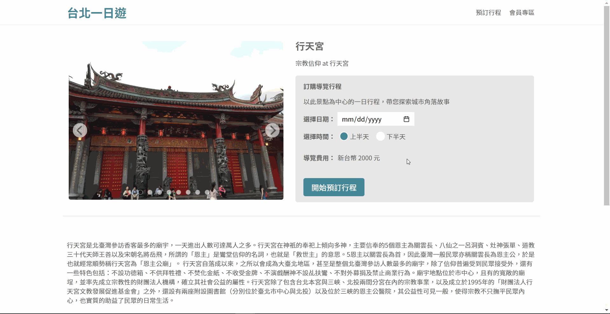

# Taipei-day-trip-website
:bus: Taipei-day-trip-website is a travel e-commerce website. You can click on the photos of the attractions to view more information, and make reservations and payment.

## Table of Contents

- [About the project](#about-the-project)
- [Frontend Technique](#frontend-technique)
- [Backend Technique](#backend-technique)
- [Usages](#usages)
- [Contact](#contact)

## About the project

:link: Website URL : http://34.195.43.91:3000 

:art: [Figma Prototype](https://www.figma.com/file/CeFwqBSbNWZbWz2ih4YS6z)

:notebook: [API doc](https://app.swaggerhub.com/apis-docs/padax/taipei-trip/1.0.0)

- Test account : 123@mail.com    
- Test password : 123
- Test credit card : 

  | Name           | Value                   |
  | -------------- | ----------------------- |
  | Card number    | 4242 4242 4242 4242     |
  | Expiration date| 0123                    |
  | CVV            | 123                     |

## Frontend Technique

- HTML
- CSS
- Vanilla JavaScript
- AJAX
- Responsive Website Design
- Third Party Library
  -  [TapPay](https://www.tappaysdk.com/zh/)

## Backend Technique

- Python 
  - Flask
    - Blueprints
    - Jinja2
  - MySQL Connector
    - MySQLConnectionPool
- Authentication
  - JSON Web Token(JWT) module
- Cloud Services
  - AWS EC2
- Linux on Window
  - WSL2
- Database 
  - MySQL
  - Database Schema
   

## Usages

- Infinite scroll of attractions

    
  
     
     
 
- Users can type keywords to find their destinations.

   
  
     
     
  
- Click on the attraction, and users can find detailed information and related pictures.

   

     
     

- Pop-up modal of sign in/ sign up with frontend and backend validation
  
   

     
     
  
- After signing in, users can book the trip and pay online by TapPay.  
  
   

     
     
  
- In member system, users can alter their password and check their order history.
  
   
  
     
     
  
- Responsive web design  
  
   
  
     
     

## Contact  
 **林怡君   Yi-Jun, Lin**
  
 
 Email: tinalin923@gmail.com 
  
 
 Find me on [LinkedIn](https://www.linkedin.com/in/yi-jun-lin-353a14226/)
